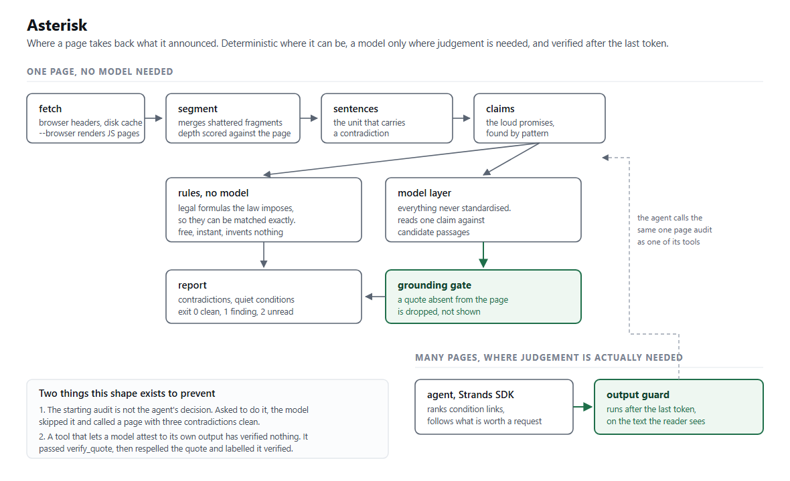
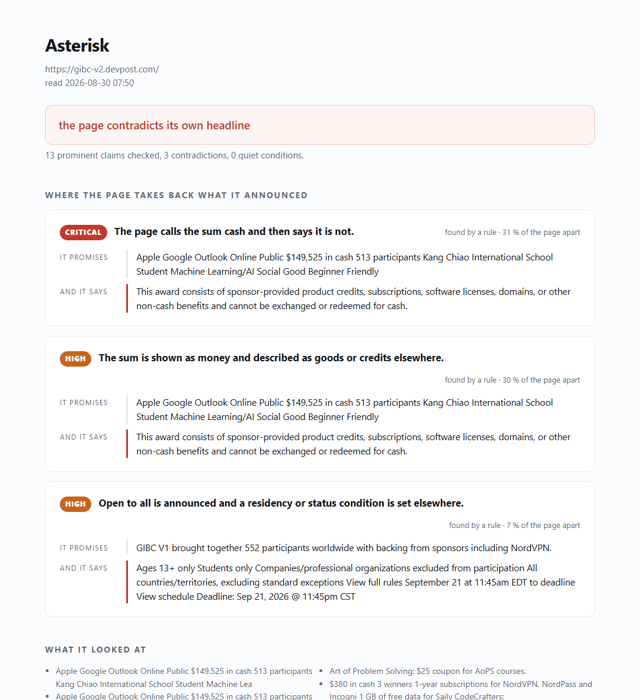

# Asterisk

**Read the asterisk before you read the promise.**

Asterisk takes a web page and reports two things.

1. **Contradictions.** Where the page announces something loudly and takes it
   back quietly, somewhere else on the same page.
2. **Quiet conditions.** What the page requires of you without ever promising
   otherwise, so no contradiction detector would catch it.

Every line it prints is a verbatim quote from the page. A finding that cannot
be pointed at is dropped before you see it.

**Reports on eight pages you already know**, generated by this repository and
rebuilt by one command, <https://thibaudlepan77-svg.github.io/asterisk/>. They
are static reports and not a live service, and one page is in the gallery
because the tool REFUSES to audit it.

MIT licensed. The deterministic half has no dependencies at all. The model half
speaks the OpenAI chat completions shape, so it runs against any endpoint that
does, set by two environment variables. It was developed and measured against
an OpenAI compatible endpoint serving `openai/gpt-oss-120b`, and that is the
configuration the numbers below come from. Nothing in the code knows a vendor.

### Thirty seconds

```bash
git clone https://github.com/thibaudlepan77-svg/asterisk && cd asterisk
python cli.py --offline https://gibc-v2.devpost.com/     # no key, no install
python tests_asterisk.py                                 # 63 tests
python eval/run_eval.py --offline                        # the numbers, rerun
```

[Why it exists](#why-it-exists) ·
[On a real page](#what-it-does-on-a-real-page) ·
[How it works](#how-it-works) ·
[Results](#results) ·
[The agent](#the-agent-and-the-failure-that-shaped-it) ·
[Watching](#watching-because-an-offer-is-a-moving-thing) ·
[Install](#install-and-run) ·
[What it does not do](#what-it-does-not-do-stated-plainly)

---

## Why it exists

On 30 August 2026 I was comparing open online contests, ranking them by prize
divided by number of entrants, looking for the best place to spend a month of
work. One entry topped the ranking by a wide margin. It advertised

> **$149,525 in prizes**

and its machine readable listing declared **five cash prizes**. Five hundred
and twelve people had registered. On paper it was the best opportunity on the
board by a factor of five.

Its own prize section says, fifteen times, under every single tier

> ⚠️ THIS IS NOT A CASH PRIZE. This award consists of sponsor-provided product
> credits, subscriptions, software licenses, domains, or other non-cash
> benefits and cannot be exchanged or redeemed for cash.

The real cash was zero. The number I was ranking on had been typed in by the
person who benefits from it being large, and the page contradicted it in plain
sight, in the one place the law forces an advertiser to tell the truth.

Then it got worse. I read the long legal rules of twenty two contests by hand
and published a figure, twelve of them open to an adult in my country. When I
pointed the first working build of this tool at the same twenty two pages, it
came back with `Students only` on pages I had cleared myself three hours
earlier. The real number was eight, not twelve. **The tool's first useful act
was to correct its own author.**

That is the problem. Not fraud, and usually not even a lie. A number in one
place and its cancellation in another, with a scroll bar in between.

---

## What it does, on a real page

```
$ python cli.py https://gibc-v2.devpost.com/

13 prominent claims checked. 3 contradictions, 0 quiet conditions.
Verdict, the page contradicts its own headline

CONTRADICTIONS, where the page takes back what it announced

1. [CRITICAL] The page calls the sum cash and then says it is not.
   found by   deterministic rule
   PROMISE    ... Online Public $149,525 in cash 513 participants ...
   FINE PRINT This award consists of sponsor-provided product credits,
              subscriptions, software licenses, domains, or other non-cash
              benefits and cannot be exchanged or redeemed for cash.

3. [HIGH] Open to all is announced and a residency or status condition is set
   elsewhere.
   found by   deterministic rule
   PROMISE    GIBC V1 brought together 552 participants worldwide with backing
              from sponsors including NordVPN.
   FINE PRINT Ages 13+ only Students only Companies/professional organizations
              excluded from participation
```

The count of quiet conditions is zero here on purpose. The students clause was
already reported above as a contradiction, because this page does claim to be
worldwide, so reporting it twice would pad the output. Quiet conditions are for
what nothing on the page contradicts.



It also writes a self contained HTML report, one file, no server and no assets,
that can be opened, mailed, or kept as a dated record of what an offer said on
the day you accepted it.

```bash
python cli.py --offline --html report.html https://example.com/offer
```



---

## How it works

Four stages. The interesting decisions are in the middle two, and both of them
came from a measurement that said the first design was wrong.

**1. Segment** (`asterisk/segment.py`). The page is cut into lines and each
line is scored for prominence from its tag, its nesting depth relative to the
rest of the page, and its position. Two things had to be learned on real
pages. Modern markup shatters a sentence, so `$`, `149,525` and `in cash`
arrive as three sibling elements and any matcher that keeps them apart finds
nothing at all. And real pages nest twelve to sixteen levels deep, so a
prominence score that divides by absolute depth collapses to zero everywhere.

**2. Sentences** (`asterisk/sentences.py`). The first design compared a loud
block with a quiet block. It scored zero on live pages, because the clause
that cancels a promise is very often in the **same** block, two sentences
later. The unit that carries a contradiction is the sentence.

**3. Detect** (`asterisk/audit.py`, `asterisk/restrictions.py`). Two layers.

- A deterministic layer with no model at all. Consumer law imposes the exact
  wording of the disclaimers that matter, so they can be matched exactly. It
  is free, instant, and it invents nothing.
- A model layer for everything the formulas miss, because most of the world's
  fine print was never standardised. This is where a model reads a claim
  against candidate passages and judges whether one cancels the other. On the
  contest page below it is the layer that caught a second denial the rules had
  no formula for, `THIS COMPETITION DOES NOT HAVE CASH PRIZE` sitting on the
  same page as `$292 in cash 500 winners`.

**4. Ground** (`Document.contains`). The gate the model cannot argue with.
Any quote the model returns is checked, character for character, against the
page. If it is not there, the finding is discarded and never reaches the
report. This is the only defence against a confident summary of something the
page never said.

---

## Results

Two evaluations. Both run from this repository, both on live pages, and the
labels for both are checkable by anyone who opens the page.

### The distance, which is the whole thesis with a number on it

The claim this tool is built on is that a promise and the sentence cancelling
it are separated by a scroll bar. That is an assertion until it carries a
number, so every finding now reports how far apart the two sit, as a share of
the page.

Across the 62 pages of both evaluation sets, 17 contradictions could be located
on both sides.

| | share of the page |
|---|---|
| median distance between a promise and its denial | **30 %** |
| quarter of cases below | 7 % |
| quarter of cases above | 42 % |
| furthest apart | 77 % |
| **close enough to be on screen together**, under 5 % | **4 of 17, 24 %** |

**Three quarters of the time you cannot see both halves at once.** Seventeen is
a small number and it is written here rather than rounded away, but the
direction is the point. Nothing is hidden on these pages. It is simply not on
the same screen.

**One correction to that thesis, found the same day.** On a contest rulebook,
the pair that mattered sat **1 % of the page apart**, two paragraphs from each
other. There is no scroll bar between them. A legal document does not hide
things by distance, it hides them by length and by sameness of tone, and page
after page of clauses in the same register is its own kind of cover. The 30 %
figure describes commercial pages. It says nothing about the documents those
pages link to.

### Development set, 22 pages the rules were written against

| label | precision | recall | F1 | positives |
|---|---|---|---|---|
| prize is not cash | 1.00 | 1.00 | 1.00 | 3 of 22 |
| reserved to students | 1.00 | 1.00 | 1.00 | 14 of 22 |
| team required | 1.00 | 1.00 | 1.00 | 1 of 22 |
| a video is required | 0.94 | 1.00 | 0.97 | 15 of 22 |

```
python eval/run_eval.py --offline --show-errors
```

**The last two labels were added on 30 August, and they were added because the
tool prints eleven families of restriction and two of them had ever been
scored.** Nine tenths of what it says carried no number in front of it, and a
number nobody has is indistinguishable from a number that is bad. Both new
labels are read from a source the auditor never parses, the structured
eligibility card and the submission requirements block.

**This table used to read 0.75 precision on the first label, and the note under
it was wrong.** The single false positive was a contest paying $12,000 in cash
whose page also mentions, under a heading about free partner credits, that
`AWS Promotional Credits are not redeemable for cash`. Both sentences are true
and neither denies the other. The old note called this a limit of a binary
label on a page that is not binary, and left it in place rather than tune it
away. That was the comfortable reading and it was the wrong one.

The real defect was in the tool. The reference label is scoped to the prize
block, and the detector was reading the whole page. A denial now cancels a
money promise only when its subject is the award, either because the sentence
names it or because it sits under a prize heading. The standard legal wording
carries its own subject, `this is not a cash prize`, `the award consists of`,
so honest disclosures still fire unaided. Two tests pin both directions, one
that the aside stays quiet and one witness that a real denial still fires.

**This error pointed the wrong way, and that is why it was worth fixing rather
than documenting.** A false alarm makes you read a page for nothing. This one
made you discard a contest that really pays, and a reader who acts on it never
finds out they were wrong.

### Held out set, 40 pages never read while writing the rules

Drawn at random from a pool of 13,632 finished contests, labelled by two
targeted extractors that share no code with the auditor.

| label | result |
|---|---|
| reserved to students | precision 1.00, recall 1.00, on 4 positives and 36 negatives |
| team required | precision 1.00, recall 1.00, on 5 positives and 35 negatives |
| a video is required | precision 0.88, recall 1.00, on 7 positives and 33 negatives |
| prize is not cash | no positive case in this set, 0 false alarms on 40 pages |

```
python eval/build_holdout.py 40      # draws a fresh random sample and labels it
python eval/add_labels.py            # adds the two newer labels to both sets
python eval/run_eval.py --holdout --offline
```

### The two false alarms on the video label are the reference, not the tool

There is one on each set, and they are left in the tables rather than removed.

> A video demonstration / pitch no longer than 5 minutes.

> Submit a video demonstration of your project (3-4 minutes)

Both pages plainly require a video. **The reference label missed them**, because
it reads the block between `Requirements` and `Prizes` and on those two pages
the sentence sits outside it. Precision on this label is therefore a floor, and
the true figure is higher than 0.94 and 0.88.

The reference was already rewritten once. Its first version read four hundred
characters after the heading `What to Submit`, scored the tool at 0.27
precision with eleven false alarms, and **every one of those eleven was a page
that plainly asks for a video**. The tool was right and the measurement was
wrong. That version had been built from the one wording its author had read,
which is the same mistake this project keeps finding in its own rules.

**It was not rewritten a third time, and that is deliberate.** Tuning a
reference until the tool looks perfect is fitting the ground truth to the
answer. Two quoted misses a reader can check in ten seconds are worth more than
a 1.00 nobody can audit.

Two honest remarks about that table.

The students rule was **tightened because of this set**, not before it. The
first version matched a bare `currently enrolled` and fired on a page that used
the phrase to invite school pupils to write in, not to exclude anyone. A
restriction has to be phrased as a restriction. That one false positive is the
only thing the held out set changed, and it is worth more than the score.

The second row is not a score, it is a silence, and the difference matters. No
page in the held out set carries the non-cash disclaimer, so the row can only
tell you the detector does not cry wolf. It is also a hint worth a sentence.
Three of the twenty two contests running **today** carry that disclaimer, and
none of the forty finished ones drawn across the platform's whole history do.
That looks like a recent practice. With three cases it is a hypothesis, not a
finding, and it is written here as one.

### Two families that came from a measurement, not from an idea

Fifteen open contests carrying real cash prizes were read on 2026-08-30. The
question was not what they promise, it was what they quietly require.

**Eleven of the fifteen require you to publish on a platform you do not
control.** A video hosted on YouTube, Vimeo or TikTok, a publicly reachable
demo, or a listing on an app store. **Not one eligibility card mentions it.**
The card tells you your age, your student status, your country. It never tells
you what you will have to hand over. So a reader can be perfectly eligible,
perfectly capable, and still unable to finish, and they find out after building
everything. That is now the `third party publication required` restriction.

**On one page, being selected sends you a bill.** A hundred entrants advance,
ten receive five thousand dollars, and the other ninety owe five hundred to
continue. The only number at the top of the page is the prize. That is now
`advancement costs money`, and it is the one restriction here rated critical,
because a good outcome that costs you is the shape a reader is least prepared
for.

Both are matched deterministically, both carry witnesses in the test suite that
must stay quiet, and both were written from pages read for a real decision
rather than from imagination about what a page might say.

### A third domain, and the clearest evidence for the whole design

Contest pages and consumer offers are both marketing pages. So the tool was
pointed at a third thing, the seller terms of six online selling platforms,
starting from each one's pricing page.

| where it looked | findings |
|---|---|
| seller pricing page, six platforms | **0** |
| the conditions page, one click from that same page | **4**, on the two that were readable |

A zero on all six pricing pages is not a failure of the detector, it is the
shape of the thing. A pricing page is a commercial document and it is clean.
The document that binds you is somewhere else, and it is one link away.

On one platform's terms, quoted verbatim,

> If [the platform] considers that any withholding or deduction on account of
> tax is required by applicable law to be made from any payment pursuant to
> this Agreement, it shall be entitled to make such withholding or deduction
> (and, for the avoidance doubt, shall not be required to increase or gross-up
> any payment on account of such withholding or deduction).

Nothing on the pricing page suggests that the advertised commission is not the
only deduction. **This is the measurement that justifies the agent existing at
all.** A one page auditor answers "nothing found" on all six, which is true and
useless.

### The miss that added a rule, on the day of writing

The tool was pointed at a contest rulebook and reported it clean. Read by hand,
that page says

> Teams retain full ownership of original code, AI models, and application
> designs.

one paragraph away from

> each team grants [the sponsor] a perpetual, irrevocable, worldwide,
> royalty-free, and unlimited license to use, reproduce, modify, adapt,
> distribute, sub-license, and create derivative works from any data or
> datasets submitted

You keep the title. They take a licence that does everything a title does. No
claim kind covered that, so `ownership` was added, with two witness tests, and
the contest benchmark is unchanged.

Two things worth noticing about that case. The pair sits **1 % of the page
apart**, so proximity is not visibility, a long document hides things by length
rather than by distance. And a miss on a real page is the only reliable source
of a new rule, because nobody guesses this shape in the abstract.

### What the model layer actually adds

Every number above is the deterministic layer alone. A fair question is whether
the model earns its place, so it was measured on six live pages rather than
asserted.

| | findings |
|---|---|
| deterministic rules alone | 17 |
| new findings the model added, after filtering | 10 |
| quotes the grounding gate refused | 1 |

The model earns its place, and not evenly. Its best catch on those six pages is
a free trial claim answered by `Offer available only to students at an eligible
accredited higher education institution`, which no formula covers because
nobody standardised that sentence. Its worst habit was quoting **pricing
grids** back against price claims, a table that lost its columns in the parser
and reads like a contradiction to a model and like a table to a person. That
was fifteen additions before the filter and ten after, so **a third of what the
model offered was noise of one single kind**.

The grounding gate refused one quote in production, not only in tests. That is
one invented sentence that never reached a reader.

### Off its home ground, ten ordinary consumer offers

Everything above is contest pages. The README claimed the method generalises,
so the claim was tested rather than repeated. Ten public pricing and offer
pages from music, storage, hosting, VPN, banking, email, design, video, code
hosting and commerce. No labels, so this is a read of what the tool says and
whether a human agrees, not a score.

What it found, and these are real.

| offer | quoted back at it |
|---|---|
| music subscription | `Try 3 months of Premium Individual for $0, then $12.99/month.` |
| online bank, against a no fee claim | `A fee of 2% (or minimum fee £1) applies per transaction after your rolling monthly limit` |
| commerce platform | `After your trial, most plans start at just $1 per month for the first 3 months, then switch to standard monthly pricing.` |
| email, against unlimited | `The Proton Mail Free plan comes with 500 MB of Mail storage` |
| commerce, against unlimited | `Import unlimited orders from marketplaces 50 synced marketplace orders per month` |

What it got wrong on the first pass, and what changed.

- It paired an **instant setup** promise with a **thirty day refund window**.
  Both say a number of days and mean opposite things. Weak rules now require
  the two sentences to share a subject word, and refund windows became their
  own category with their own wording.
- It read `billed monthly` off a **pricing toggle** and called it a charge
  disclosure. Dropped.
- It matched `in credits` inside **Built-in credits** and paired a plan price
  with a feature bullet. The phrase now needs a verb of payment in front of it.

**And the gap that mattered most, now closed.** Two of the ten pages draw
their prices in the browser, so a plain fetch sees a one line shell and the
tool honestly finds nothing in nothing. Reporting that as "nothing found" is
the worst thing this tool could do, because silence and a clean bill of health
look identical to a reader.

So the tool now refuses to be silent about it.

```
$ python cli.py --offline https://www.canva.com/pricing/

!! THIS PAGE DID NOT RENDER FOR US. Almost no text came back, which usually
!! means the content is drawn by the browser. Anything below is a report on
!! an empty page, NOT a clean bill of health. Retry with --browser.
```

It exits with code 2 in that case, distinct from 0 for clean and 1 for a
finding, and the JSON output carries `page_rendered: false`. Adding
`--browser` renders the page properly, and the same Canva page goes from one
claim to eight. The browser path is optional and imported only when asked for,
because the deterministic path having zero dependencies is worth keeping.

---

## The agent, and the failure that shaped it

`cli.py` reads one page. That is not enough, and pretending otherwise is the
dangerous part. The clause that costs you is usually not on the offer page, it
is behind a small grey link, and a one page auditor that answers "nothing
found" on such an offer is worse than useless because it reassures.

`agent.py` is built on the **Strands Agents SDK**. It audits the offer, ranks
the links that could hold binding conditions, follows the ones worth a request
inside a page budget, and stops when another page would add nothing.

```bash
pip install strands-agents openai
export ASTERISK_API_KEY=...
export ASTERISK_BASE_URL=https://your-provider.example/v1
export ASTERISK_MODEL=the-model-id
python agent.py https://example.com/offer --max-pages 4
```

Three things in that loop were built after watching it fail.

**The first audit is not the agent's decision.** In the first build the model
was told to audit the starting page and then look further. It went straight to
the linked pages, found them clean, and reported that a page carrying three
contradictions had none. So the starting audit now runs deterministically and
its result is handed to the model. Anything that can be decided without
judgement should not be left to judgement.

**A tool that lets a model attest to its own output has verified nothing.**
The agent had a `verify_quote` tool. It called it. Its answer still read

> sponsor-provided product credits, subscriptions, software **licences**

where the page says `licenses`, and turned `organizations` into
`organisations`, with every line labelled verified. The model had checked the
real string and then written a tidied one, because tidying prose is what a
language model does.

So verification moved to where it cannot be talked around. `asterisk/guard.py`
runs **after the last token**, on the text the reader will see. It pulls every
quoted span out of the answer and looks it up in the pages that were actually
fetched.

```
[grounding] 3 quotes checked against the fetched pages, 2 exact, 1 altered, 0 unsupported.
  ALTERED   the answer wrote
            software licences, domains, or other non-cash benefits
            the page says
            software licenses, domains, or other non-cash benefits
```

An answer containing an unsupported quote exits non zero. The four tests in
`tests_asterisk.py` under `OutputGrounding` are witness tests, they feed the
guard a respelled quote and an invented one and require it to refuse both. A
gate that has never refused anything proves nothing.

**The page budget was a sentence in a prompt, and nothing enforced it.** The
task text read `Budget, at most 4 pages in total`. That was the whole of it. A
model that finds the fourth page interesting fetches a fifth, and the only
thing that was ever going to stop it was a paragraph asking politely. A tool
that reports where a page contradicts its own headline had a headline its own
agent could contradict.

The budget now lives in a `BeforeToolCall` hook, where `cancel_tool` turns a
refusal into a refusal. The decision itself is twenty lines in
`asterisk/budget.py` that need no model, no network and no agent to exercise,
and the hook is a five line adapter over it. It refuses two things, the page
past the limit, and a page already audited in the same run, which costs a
request and returns nothing new.

Writing that hook turned up the hole it did not cover. `verify_quote` fetched
any page it had not seen, so a model that wanted a fifth page only had to ask
it to check a quote from that page. **A limit one door enforces and another
ignores is not a limit.** It now refuses, which is also the right answer on its
own terms, since a check that fetches the page first is not testing the claim,
it is manufacturing the evidence for it.

Three tests pin the two SDK facts the hook stands on, that `Agent` still takes
`hooks`, that a tool use still carries `name` and `input`, and that the event
can still cancel. If a future version renames any of them the budget stops
firing **and nothing else fails**, because a hook that never runs looks exactly
like a hook that always allows.

---

## Watching, because an offer is a moving thing

The idea did not come from a brainstorm, it came from a stopwatch. On 30 August
2026, between 06:38 and 07:14, one contest's published count of cash prizes went
from **ten to one**. Its prize page had not changed. Nobody was told. Anyone who
had read it at 07:14 and compared it against a note from 06:38 would have seen
it, and nobody keeps such notes.

```
python cli.py --offline --watch https://example.com/offer
```

The first run stores a snapshot. Every run after that reports what moved. The
block below is an **example of the output shape**, written by hand rather than
captured, and it is labelled as such because this repository is a tool about
claims a page does not back up.

```
WHAT CHANGED, an offer is a moving thing
Compared with the snapshot taken 2026-08-30 07:31:02, 3 stored.
  APPEARED     Subscriptions renew automatically unless cancelled 24 hours before
  REWORDED     91 % the same
               was  The winner is paid within 30 days of the announcement
               now  The winner is paid within 90 days of the announcement
  PROMISE GONE Cancel any time
```

A rewording is matched rather than reported as one clause vanishing and another
appearing, because thirty days becoming ninety is one event and it is the
interesting one. `Nothing changed` is printed when nothing did, which is also
worth knowing.

---

## Install and run

No dependencies beyond the Python standard library for the deterministic path.

```bash
git clone <this repo>
cd asterisk
python cli.py --offline https://example.com/offer     # rules only, no API call
```

For the model layer, point it at any OpenAI compatible endpoint.

```bash
export ASTERISK_API_KEY=...
export ASTERISK_BASE_URL=https://your-provider.example/v1
export ASTERISK_MODEL=the-model-id
python cli.py https://example.com/offer
```

Pages are cached on disk so that iterating on prompts does not hammer
somebody's site.

One portability note that cost a debugging round. Some providers sit behind a
bot filter that answers **403 with error code 1010** to a request carrying no
browser like agent, and says nothing about authentication. The client sends a
`User-Agent` for that reason.

```
python cli.py --json URL          machine readable output
python cli.py --html FILE URL     a self contained HTML report
python cli.py --offline URL       deterministic layer only
python cli.py --browser URL       render in a real browser first
python cli.py --watch URL         snapshot, and report what moved since last time
python cli.py --loudness 0.4 URL  check less prominent claims too
python cli.py file.html           audit a saved page
```

Exit codes, 0 nothing found, 1 a critical or high contradiction, 2 the page did
not render so the result means nothing. It drops into a shell pipeline or a CI
check without extra glue, and the third code exists so that a monitor cannot
mistake blindness for a clean result.

---

## What it does not do, stated plainly

- **It is not a lie detector.** It finds a promise and a clause that disagree.
  Deciding whether that is deception, a legal necessity, or sloppy copywriting
  is the reader's job, and the tool gives them the two quotes to do it with.
- **It reads one page.** A condition kept on a separate terms page, behind a
  login, or rendered only by client side script is invisible to it today.
- **The deterministic layer is English first.** The legal formulas it matches
  are the English ones. The model layer is not language bound, the rules are.
- **The development set is small and specialised.** Twenty two contest pages.
  The held out set widens it, and neither is a survey of the web.
- **It reads what a browser would show, not what a login would show.** Prices
  behind an account, a geofence or a paywall are out of reach.
- **A false negative is silent.** The tool proves that something is on the
  page. It never proves that nothing else is.

---

## Layout

```
asterisk/segment.py       page to prominence scored lines
asterisk/sentences.py     lines to quotable sentences
asterisk/claims.py        the promises worth checking
asterisk/audit.py         contradictions, rules and model, with the grounding gate
asterisk/restrictions.py  quiet conditions that no headline contradicts
asterisk/links.py         which links could hold a binding clause, ranked
asterisk/guard.py         verifies the quotes in the FINAL answer, after the model
asterisk/watch.py         snapshots an audit and diffs it against the last one
asterisk/report.py        text and JSON output
asterisk/html.py          a self contained HTML report, one file
asterisk/service.py       the audit as one call, no interface attached
asterisk/llm.py           any OpenAI compatible endpoint
eval/                     labelled pages, scorer, held out set builder
demo/app.py               a small Gradio front end, see demo/README.md
cli.py                    one page, deterministic entry point
agent.py                  multi page agent on the Strands Agents SDK
tests_asterisk.py         regression and witness tests, 36 of them
docs/architecture.svg     the diagram above, source
video/make_video.py       builds the demo video from slides and a synthetic voice
```
